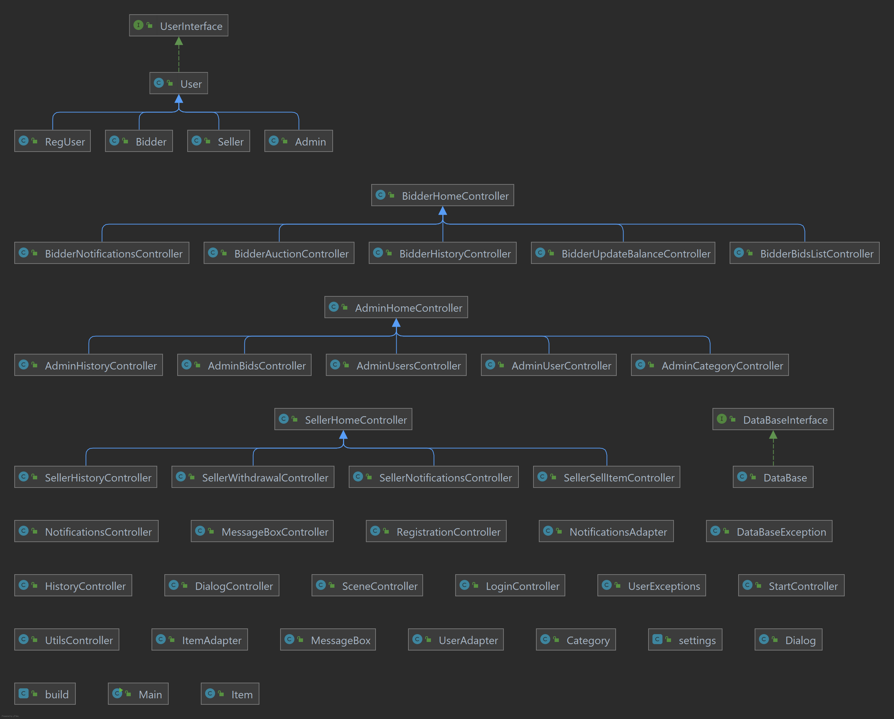
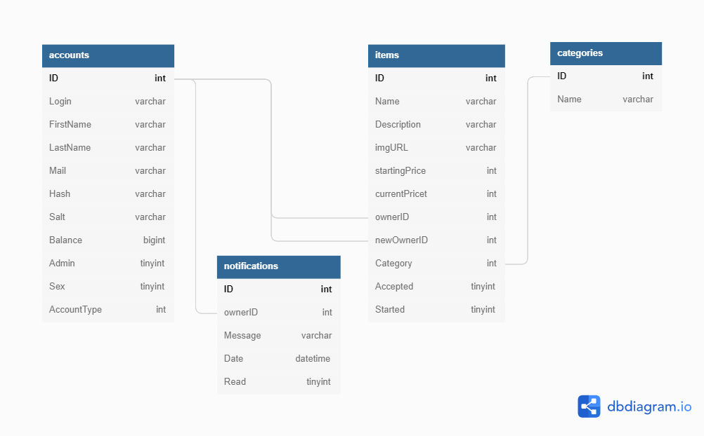

# Dmytro Dzhuha

## All in auction

This project is being developed in Java in Intellij IDE using standard libraries.
You can also run it in Eclipse.

## List of features for current version v0.0.8

- Admin side
- Bidder side
- Seller side
- Database
- SceneController
- Notification system
- Bots system

## Important code

- DataBase singletone
- User class seriallization
- Auction bot system

## UML diagram

All diagrams can be found at the following [link](001_uml_diagrams.md).

## Project Skeleton
Current active UML Class diagram:

Database Schema diagram:

