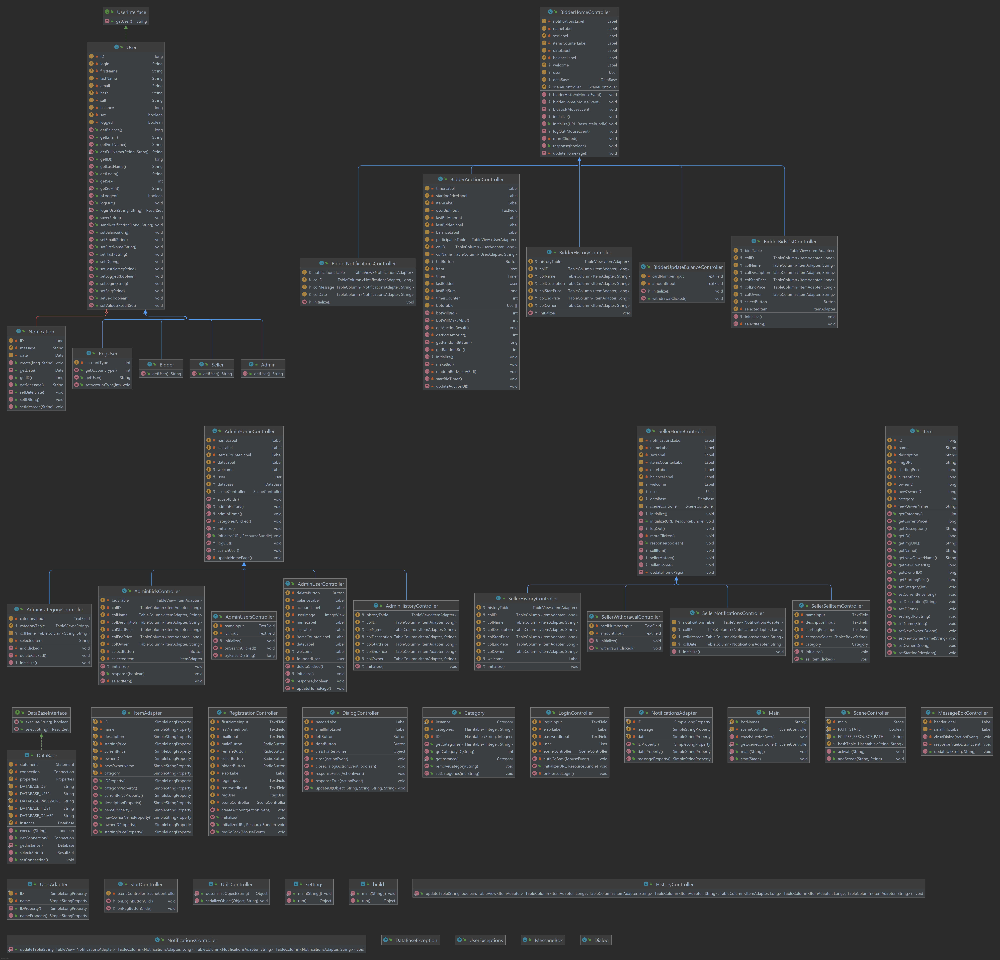

# UML diagram

Project contains the following diagrams:

- [UML diagram](#uml-diagram)
  - [Class diagram](#class-diagram)
    - [Description of classes](#description-of-classes)

## Class diagram


### Description of classes

- Adapters
  - ```ItemAdapter``` - used to convert Item data to data which suits to TableView
  - ```NotificationsAdapter``` - used to convert Notifications data to data which suits to TableView
  - ```UserAdapter``` - used to convert User data to data which suits to TableView

- Item classes
  - ```Category``` - used to deal with all categories
  - ```Item``` - describes item properties

- InfoBox classes
  - ```Dialog``` - used to call custom Dialog window
  - ```MessageBox``` - used to call custom MessageBox window
  - ```MessageBoxController``` - controller of Dialog UI
  - ```DialogController``` - controller of MessageBox UI

- User classes
  - ```Admin``` - class of user which type is Admin
  - ```Bidder``` - class of user which type is Bidder
  - ```Seller``` - class of user which type is Seller
  - ```RegUser``` - class of user which register at system
  - ```User``` - main class which describes user properties

- UI
  - ```LoginController``` - controller of login UI
  - ```RegistrationController``` - controller of registration UI
  - ```StartController``` - controller of starting window
  - ```Admin[...]Controller``` - controllers of admin UI
  - ```Bidder[...]Controller``` - controllers of bidder UI
  - ```Seller[...]Controller``` - controllers of seller UI
  - ```HistoryController``` - controller for table in different UI's

- Engines
  - ```SceneController``` - used to switch between scenes with one line of code
  - ```UtilsController``` - used for different static functions
  - ```DataBasee``` - used to work with database

- Exceptions
  - ```[...]Exception``` - custom exceptions

- Main
  - ```Main``` - Main class, entry point

